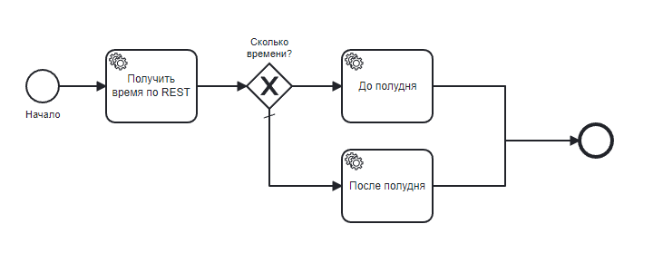

# Demo kotlin project for camunda 8

## Architecture

**Engine process**:

* **Camunda Platform**
* **Zeebe**

**Frameworks**:

* **Spring**

### Schema:



Чтобы запустить процесс, необходимо сделать GET запрос
````
curl -L -X GET 'localhost:8080/start'
````
